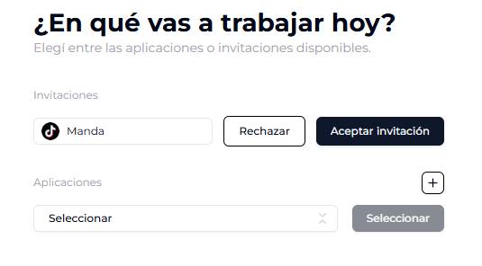

# ¿En qué proyecto vas a trabajar?

Ya sea desde una cuenta recién creada, con credenciales o a través de Google, ya estás listo para ingresar al backoffice\! Solo nos falta un paso más: elegir entre las invitaciones o crear tu aplicación\!

#### Acepta una invitación

En caso que tengas una invitación disponible, vas a poder aceptarla en esta pantalla. De lo contrario, podrás crear tu proyecto haciendo click en el signo "+".

#### Crea un nuevo proyecto

Si clickeaste en el signo "+" vas a llegar a esta pantalla que te va a permitir darle nombre a tu proyecto e ingresar al backoffice.

#### Elegí tu aplicación

Si no es la primera vez que ingresás y ya tenés aplicaciones disponibles, vas a poder elegir con cuál de ellas ingresar a través de este listado, **¡super facil\!**

  