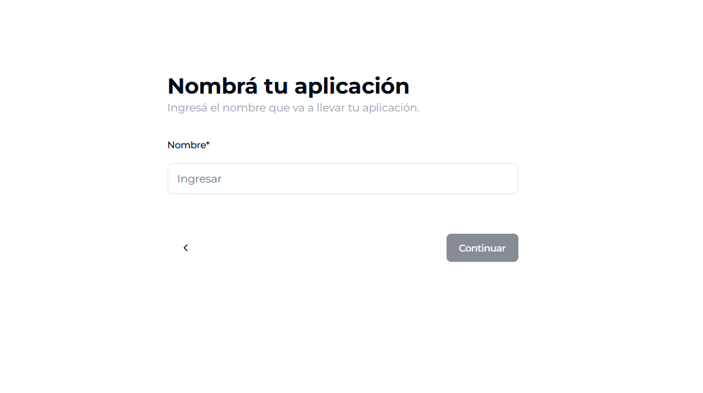

# ¿Primera vez?

Para crear tu cuenta, solo necesitamos que nos proporciones la dirección de correo electrónico que usarás para iniciar sesión.

## Validación de correo electrónico

Para comenzar a crear tu cuenta, solo necesitas proporcionar tu dirección de correo electrónico. Luego, recibirás un código en esa dirección, que deberás ingresar en la siguiente pantalla. 

Una vez que hayas validado tu correo electrónico, podrás crear tu contraseña.

## Crear contraseña

Para comenzar, crea una contraseña alfanumérica que contenga entre 8 y 16 caracteres. Asegúrate de incluir al menos un número, una letra mayúscula y una letra minúscula.

Luego, vuelve a escribir la contraseña para confirmar que es correcta. 

Una vez que hayas aceptado los términos y condiciones, podrás proceder a la validación de tu número de teléfono.

 

## Validación de teléfono

Lo primero que tenés que hacer en este paso, es seleccionar el código de tu país.  Luego, ingresá tu número de teléfono sin el 15, sin el 0 y sin el 9 al principio. 

 

## ¡Último paso\!

Para finalizar el proceso, necesitamos recopilar algunos datos personales. Por favor, ingrese su nombre completo, incluyendo tanto nombre como apellido, así como su fecha de nacimiento.

Esta información es crucial para verificar su identidad y garantizar la seguridad de su cuenta.

## 2\. ¿En qué proyecto vas a trabajar?

Ya sea desde una cuenta recién creada, con credenciales o a través de Google, ya estás listo para ingresar al backoffice\! Solo nos falta un paso más: elegir entre las invitaciones o crear tu aplicación\!

#### 2.1. Acepta una invitación

En caso que tengas una invitación disponible, vas a poder aceptarla en esta pantalla. Sino, haciendo click en el signo "+" vas a poder crear tu proyecto.

####  2.2 Crea un nuevo proyecto

Si clickeaste en el signo "+" vas a llegar a esta pantalla que te va a permitir darle nombre a tu proyecto e ingresar al backoffice.

#### 2.3 Elegí tu aplicación

Si no es la primera vez que ingresás y ya tenés aplicaciones disponibles, vas a poder elegir con cuál de ellas ingresar a través de este listado, super facil\!

  